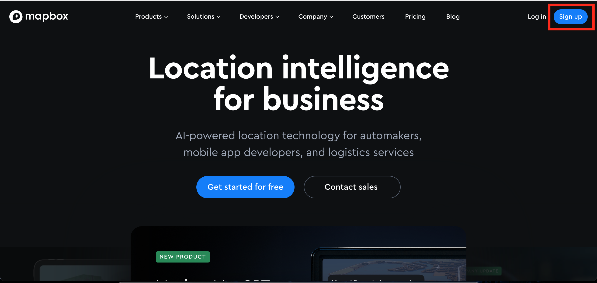
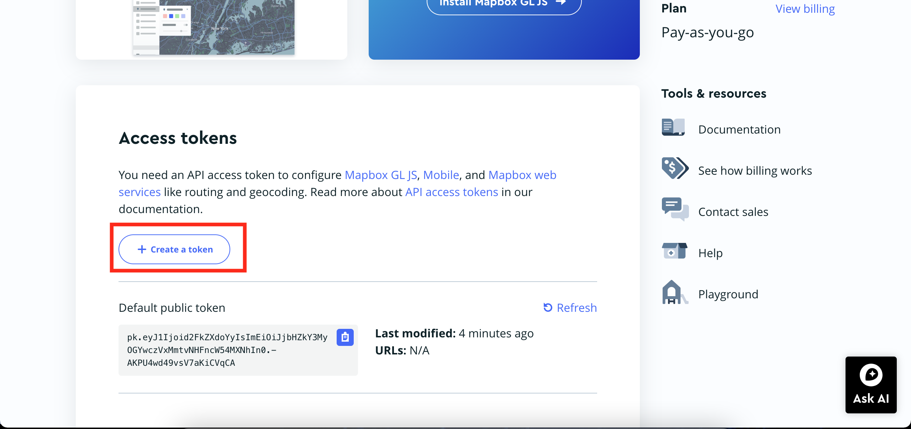
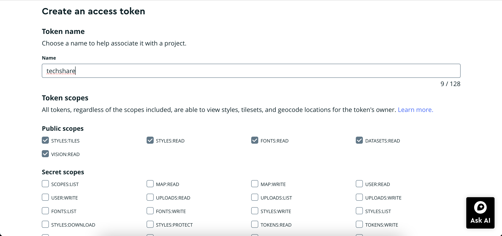
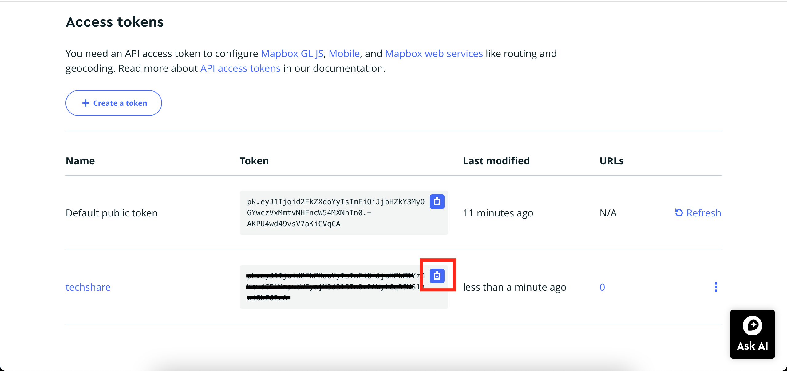
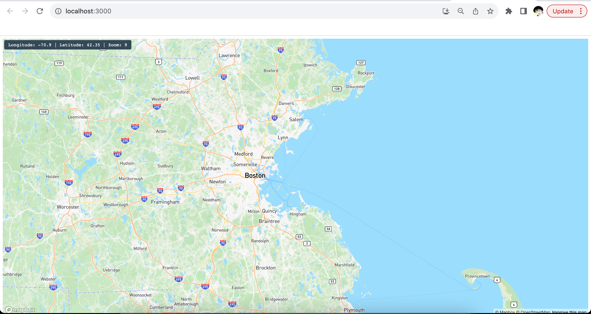

# Delulu Tech Share: Mapbox API

## Table of Contents
- [Delulu Tech Share: Mapbox API](#delulu-tech-share-mapbox-api)
  - [Table of Contents](#table-of-contents)
  - [Introduction](#introduction)
  - [Registration](#registration)
    - [1. Create an Account](#1-create-an-account)
    - [2. Create an Access Token](#2-create-an-access-token)
  - [Map setup](#map-setup)
    - [1. Create React app](#1-create-react-app)
      - [Install Node.js and npm](#install-nodejs-and-npm)
      - [Install and create a new React app](#install-and-create-a-new-react-app)
    - [2. Set up basic map](#2-set-up-basic-map)
    - [3. Edit Map Settings](#3-edit-map-settings)
      - [1. Styles](#1-styles)
      - [2. Zoom level](#2-zoom-level)
      - [3. Center and Current Location](#3-center-and-current-location)
      - [4. Add data (how to load and visualize geographic data on the map)](#4-add-data-how-to-load-and-visualize-geographic-data-on-the-map)
  - [Examples](#examples)
      - [1. Get the coordinates of the mouse pointer](#1-get-the-coordinates-of-the-mouse-pointer)
      - [2. Display map scale](#2-display-map-scale)
      - [3. Display zoom and rotation controls](#3-display-zoom-and-rotation-controls)
    - [How to make the map interactive](#how-to-make-the-map-interactive)
      - [Search for places](#search-for-places)
      - [Popup windows of locations on click](#popup-windows-of-locations-on-click)
  - [References and Links to More Info](#references-and-links-to-more-info)

---

## Introduction
**Mapbox** is a handy tool for making your own maps, charts, and location-based apps. It's packed with easy-to-use features like APIs and SDKs. In this tech share, we'll walk you through setting up a basic React map using Mapbox.


---

## Registration

Before setting up our map, we need to register in Mapbox.

### 1. Create an Account

Click [here](https://www.mapbox.com/) to navigate to the website. Then, click the **sign up** button at the upper right corner:



---

### 2. Create an Access Token

Once you've signed up and verified your email, follow these steps:

1. Go to the account home page.
2. Scroll down and click on **create a token**:



---

3. Choose a name for your token and keep the token scope default.
4. Scroll down and click **create** at the end:



---

5. Now you have your access token. Click the button to copy it for later use:



---

## Map setup 
### 1. Create React app
#### Install Node.js and npm
If you haven't already, download and install [Node.js](https://nodejs.org/en), which includes npm.

#### Install and create a new React app
Open your terminal, copy and paste and run the following line to install Create React App globally:

 ```shell
npm install -g create-react-app
 ```

Once you have it downloaded, navigate to the directory you want to create the Map app and run the following code:

```shell
npx create-react-app mapbox-app
```

### 2. Set up basic map
1. After creating the React app, open the project folder in your code editor. Navigate to `src/index.js` and add the necessary stylesheets and Mapbox GL JS for your map:

    ```js
    import React from 'react';
    import ReactDOM from 'react-dom';
    import 'mapbox-gl/dist/mapbox-gl.css'; // The stylesheet contains the Mapbox GL JS styles to display the map.
    import './index.css';
    import App from './App';

    ReactDOM.render(
    <React.StrictMode>
        <App />
    </React.StrictMode>,
    document.getElementById('root')
    );
    ```

2. Now navigate to `src/App.js` and add the following (see comments for details):

    ```js
    import React, { useRef, useEffect, useState } from 'react';

    // To use Mapbox GL with Create React App, you must add an exclamation point to exclude mapbox-gl from transpilation and disable the eslint rule import/no-webpack-loader-syntax
    import mapboxgl from '!mapbox-gl'; // eslint-disable-line import/no-webpack-loader-syntax

    // use the access token you gain from registration
    mapboxgl.accessToken = 'YOUR_MAPBOX_ACCESS_TOKEN';

    export default function App() {
    const mapContainer = useRef(null);
    const map = useRef(null);

    // The state stores the longitude, latitude, and zoom for the map. These values will all change as your user interacts with the map.
    const [lng, setLng] = useState(-70.9);
    const [lat, setLat] = useState(42.35);
    const [zoom, setZoom] = useState(9);

    useEffect(() => {
        if (map.current) return; // initialize map only once
        map.current = new mapboxgl.Map({
        container: mapContainer.current,
        style: 'mapbox://styles/mapbox/streets-v12',
        center: [lng, lat],
        zoom: zoom
        });

        map.current.on('move', () => {
        setLng(map.current.getCenter().lng.toFixed(4));
        setLat(map.current.getCenter().lat.toFixed(4));
        setZoom(map.current.getZoom().toFixed(2));
        });
    });

    return (
        <div>
        <div className="sidebar">
            Longitude: {lng} | Latitude: {lat} | Zoom: {zoom}
        </div>
        <div ref={mapContainer} className="map-container" />
        </div>
    );
    }
    ```


3. Then, navigate to `src/index.css` and add the following:
   
    ```css
    .map-container {
    height: 100vh; /*edit here to change map size*/
    }

    .sidebar {
    background-color: rgb(35 55 75 / 90%);
    color: #fff;
    padding: 6px 12px;
    font-family: monospace;
    z-index: 1;
    position: absolute;
    top: 0;
    left: 0;
    margin: 12px;
    border-radius: 4px;
    }
    ```

4. Now we are done with implementing the basic map, before we run it, we need to install mapbox-gl if we have not:
    ``` shell
    npm install mapbox-gl
    ```

    after done installing, run the program with this line in terminal:

    ``` shell
    npm start
    ```

    Navigate to `http://localhost:3000` to see the map:

    
    </div>


### 3. Edit Map Settings
#### 1. Styles 
To change the map style in the implemented map, modify the `style` in `src/App.js` to use the styles link provided by [Mapbox](https://docs.mapbox.com/api/maps/styles/). For instance, to switch to the satellite street style, replace it with the satellite map link:

```js
map.current = new mapboxgl.Map({
      container: mapContainer.current,
      style: 'mapbox://styles/mapbox/satellite-streets-v12', // change here
      center: [lng, lat],
      zoom: zoom
    });
```

Here we can see how the map looks like with new style:


</div>


#### 2. Zoom level
Zoom levels control the extent of the world visible on a map. Mapbox offers maps across 23 zoom levels, ranging from 0 (fully zoomed out) to 22 (fully zoomed in).

Here is a reference of what users would see with different zoom levels:
| at zoom level | what you can see |
|----------|----------|
| 0 | The Earth |
| 3 | A continent |
| 4 | Large islands |
| 6 | Large rivers |
| 10 | Large roads |
| 15 | Buildings |

We can change the zoom level in `src/App.js`:
```js
const [zoom, setZoom] = useState(9); // Replace '9' with your preferred zoom level
```

#### 3. Center and Current Location 
The **center location** on a map typically refers to the geographical coordinates around which the map is centered and displayed to the user. 

We can change the map center location by changing the longitude and latitude in `src/App.js`:
```js
  const [lng, setLng] = useState(-70.9); // replace -70.9 to preferred longitude
  const [lat, setLat] = useState(42.35); // replace -42.35 to preferred latitude
```
We can also set the center location to user's **current location** by change the following code in `src/App.js`:

```js
useEffect(() => {
    if (map.current) return; 

    // Add this function to get current location
    const getCurrentLocation = () => {
        navigator.geolocation.getCurrentPosition((position) => {
            const { longitude, latitude } = position.coords;
            setLng(longitude);
            setLat(latitude);
            map.current.setCenter([longitude, latitude]);
        });
    };

    map.current = new mapboxgl.Map({
        container: mapContainer.current,
        style: 'mapbox://styles/mapbox/streets-v12',
        center: [lng, lat],
        zoom: zoom
    });

    map.current.on('move', () => {
        setLng(map.current.getCenter().lng.toFixed(4));
        setLat(map.current.getCenter().lat.toFixed(4));
        setZoom(map.current.getZoom().toFixed(2));
    });

    getCurrentLocation();

    // eslint-disable-next-line react-hooks/exhaustive-deps
  }, []);
```


#### 4. Add data (how to load and visualize geographic data on the map) 

---
## Examples

Now that we've developed a comprehensive map, here are additional functionalities we can incorporate.

#### 1. Get the coordinates of the mouse pointer 
To retrieve the coordinates of the mouse pointer, you can utilize Mapbox GL JS events.

In `src/App.js`, add the following:

```js
map.current.on('mousemove', (e) => {
  document.getElementById('info').innerHTML =
    // `e.point` is the x, y coordinates of the `mousemove` event
    // relative to the top-left corner of the map.
    JSON.stringify(e.point) +
    '<br />' +
    // `e.lngLat` is the longitude, latitude geographical position of the event.
    JSON.stringify(e.lngLat.wrap());
});
```

Then, in the return section of the same file, include the following HTML element to display the coordinates:

```js
<pre id="info"></pre> 
```
<div style="text-align:center;">

</div>

This code listens for the `mousemove` event on the map and displays the coordinates of the mouse pointer relative to the map container along with the corresponding longitude and latitude.

#### 2. Display map scale
To show the map scale dynamically, you can use the `ScaleControl` provided by Mapbox GL JS.

In `src/App.js`, add:

```js
map.current.addControl(new mapboxgl.ScaleControl());
```
<div style="text-align:center;">

</div>

This snippet initializes and adds a scale control, allowing users to visualize the map scale in real-time, typically in metric or imperial units, depending on the map's zoom level.

#### 3. Display zoom and rotation controls 
To add zoom and rotation controls to your Mapbox map, you can utilize the `NavigationControl` provided by Mapbox GL JS.

Add the following code snippet to `src/App.js`:

```js
map.current.addControl(new mapboxgl.NavigationControl());
```

<div style="text-align:center;">

</div>

These controls empower users to zoom in, zoom out, and rotate the map view, providing an intuitive way to interact with the map and customize their view as needed.

### How to make the map interactive

#### Search for places 
#### Popup windows of locations on click 


## References and Links to More Info
[Mapbox API documents](https://docs.mapbox.com/)  

